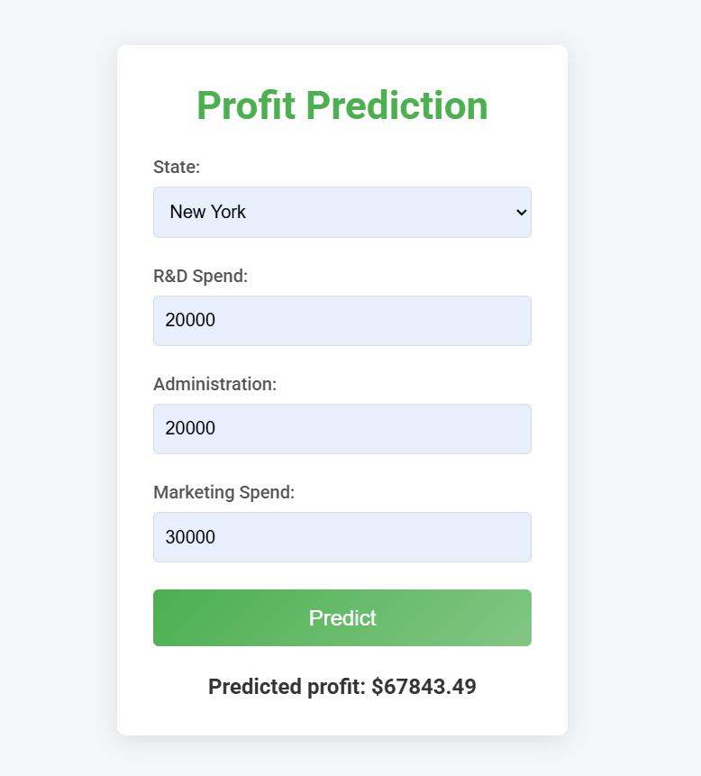

# StartUps Profit Prediction

### Live Demo: [StartUps Profit Prediction](https://startups-profit-prediction.onrender.com)

## 📄 Overview
This project predicts the profit of startups based on features like R&D Spend, Administration Spend, Marketing Spend, and the State in which the startup operates. The application is built using Flask for the backend, and a linear regression model is employed for prediction.

---

## 📂 Project Structure

**File Structure:**
- **app.py:** The main Flask application that handles API requests and serves the web interface.
- **startups.ipynb:** Jupyter Notebook containing exploratory data analysis (EDA), data preprocessing, and model training.
- **50_Startups.csv:** Dataset used for training and testing the model.
- **model.pkl:** Pickle file containing the serialized trained model.
- **requirements.txt:** Dependencies required to run the project.
- **templates:** Directory containing HTML templates for the web interface.
- **README.md:** Documentation of the project (you are here!).

---

## 💻 Requirements

To run this project locally, ensure you have Python installed. Install the required dependencies using the following command:

```bash
pip install -r requirements.txt
```

### Dependencies:
- numpy
- pandas
- scikit-learn
- matplotlib
- seaborn
- flask

---

## 🚀 Features

- Input fields for R&D Spend, Administration Spend, Marketing Spend, and State.
- Predicts the profit based on user inputs.
- Web application with a clean and user-friendly interface.

---

## 🛠️ How to Run the Project Locally

1. **Clone the Repository:**
   ```bash
   git clone https://github.com/prantikm07/StartUps-Profit-Prediction.git
   cd StartUps-Profit-Prediction
   ```

2. **Install Dependencies:**
   ```bash
   pip install -r requirements.txt
   ```

3. **Run the Flask App:**
   ```bash
   python app.py
   ```

4. **Access the Application:**
   Open your browser and navigate to `http://127.0.0.1:5000`.

---

## 📊 Dataset Information

The `50_Startups.csv` dataset contains the following columns:
- **R&D Spend:** The amount of money spent on research and development.
- **Administration:** The amount of money spent on administration.
- **Marketing Spend:** The amount of money spent on marketing.
- **State:** The state in which the startup operates.
- **Profit:** The profit earned by the startup (target variable).

---

## 🧪 Model Details

- **Algorithm:** Linear Regression
- **Library Used:** Scikit-learn
- **Model Serialization:** The trained model is saved as `model.pkl` using the `pickle` library.

---

## 🎨 Web Interface
The web interface allows users to:
1. Input data for R&D Spend, Administration Spend, Marketing Spend, and State.
2. Get an instant profit prediction for their startup.

---

## 📸 Screenshots



---


## 🤝 Contribution Guidelines
Contributions are welcome! To contribute:
1. Fork the repository.
2. Create a feature branch: `git checkout -b feature-name`.
3. Commit your changes: `git commit -m 'Add feature name'`.
4. Push to the branch: `git push origin feature-name`.
5. Create a pull request.

---

## 📧 Contact
For queries or suggestions, feel free to reach out:
- **Email:** [prantik25m@gmail.com](mailto:prantik25m@gmail.com)
- **LinkedIn:** [Prantik Mukhopadhyay](https://www.linkedin.com/in/prantikm07/)

---

## ⚖️ License
This project is licensed under the MIT License. See the `LICENSE` file for details.

